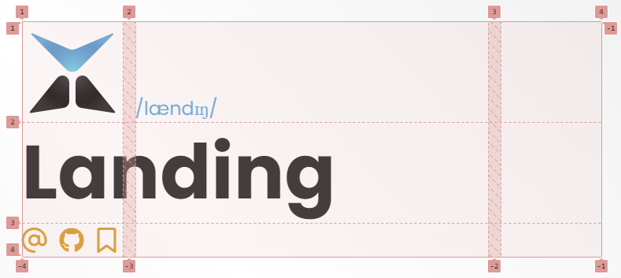

The following parameters can be added to the `theme` section of your `mkdocs.yaml` file to control how your specific site deviates from Landing's default look and feel, to give it your own identity. [Click here](https://www.mkdocs.org/user-guide/configuration/) for a general guide on using mkdocs and the `mkdocs.yaml` configuration file.


# Header
The below parameters are for configuring the layout and appearance of the header, which appears at the top of the main homepage of your site.

### `header_layout`
The header is laid out in a grid with three columns; the outer columns are each the width of your avatar (defined in [`avatar_size`](#avatar_size)), the middle column is the remaining space. Within the header are several different "elements" - this parameter defines which elements are included and in what order they are laid out. The elements available are:

- avatar (1 column wide): The image defined in [`avatar`](#avatar)
- tagline (2 columns wide): The markdown text defined in [`tagline`](#tagline)
- nav (2 columns wide): Top level links from the site-wide navigation defined in [`nav`](https://www.mkdocs.org/user-guide/configuration/#nav) (in general config)
- title (2 columns wide): The name of your site defined in [`site_name`](https://www.mkdocs.org/user-guide/configuration/#site_name) (in general config)
- socials (2 columns wide): Social media links defined in [`socials`](#socials)

You can also include a blank list item to put an empty div tag if you need to fill a column. Once an element spans past the final column, it is moved to the row below in order to fit. The image below shows how the header on this site is laid out, with the grid visible thanks to Google Chrome's "inspect" tool:



So the first row has the avatar (1 column wide) and the tagline (2 columns wide), forcing the title (2 columns wide) onto the next row. As there is only 1 column left on this row and the social links are 2 columns wide, they are forced onto the next row.

### `avatar`
Image of yourself, this will appear in the heading of the main page.

### `avatar_size`
The width of the avatar, default is 8rem.

### `round_avatar`
If True, then the avatar will be cropped into a circle.

### `tagline`
A markdown string to be displayed in the header, smaller than the title. For professional profiles, this might be your job title or demographic information (e.g. pronouns, name pronunciation).

### `socials`
List of social links to include, should be in the format:
```
- label: <text to display if the icon doesn't load>
  link: <url to link to when clicked>
  icon: <name of the icon to use, from fontawesome>
```
All of the free fontawesome icons are supported, you can also use `["brands", <icon name>]` to use a brand logo instead (such as GitHub, Facebook, BlueSky, etc.)


# Content box
The below parameters are for configuring the content box, which contains the content of your site (and the header) and sits in front of the background.

### `content_box_opacity`
The box containing your site content will always be color you define for [`base_color`](#shades), this parameter controls how opaque it is over the background.

### `content_box_padding`
The distance between the horizontal edges of your content and the edges of the content box.

### `border_left` / `border_right`
The border on either side of the content box (defined using the same syntax as in `border-left`/`border-right` in CSS).


# Background
The below parameters are for configuring the background of your site, which sits behind the content box.

### `background`
Background for the whole page, . Syntax is the same as the CSS `background` property. By default, the background color of your site will be the color you define for [`base_color`](#shades) and there is no background image.

### `background_color`
Color override for `background`. Whatever value is in here will be used for the CSS `background-color` property (which overrides any color set in `background`). 

### `background_image`
Image override for `background`. Whatever value is in here will be used for the CSS `background-image` property (which overrides any color set in `background`). Unlike `background`, you do not need to include the `url(...)` wrapper - just a file path will suffice.

## Background gradient
The background gradient is a gradient overlay which sits on top of your background but still behind the content box.

### `background_gradient_angle`
The angle of the background gradient, by default this will be 45° (i.e. from bottom left to top right).

### `background_gradient_colors`
The colors comprising the background gradient, as a list. These will be evenly spaced out, but you can use the same color multiple times to have it occupy more space. You can use any CSS color syntax, including `transparent` and `color-mix(<color 1> <amount>%, <color 2>)`. The default colors are:

- Your [`mantle_color`](#shades) at 80% opacity
- `transparent`
- Your [`crust_color`](#shades) at 20% opacity


# Footer
The below parameters are for configuring the content of the footer, which appears at the bottom of all pages on your site.

### `footer`
Markdown content to include in the page footer

### `page_source`
Optionally add a link to this page's source code, for example on GitHub. Can be specified as either:
```
page_source:
  link: <link to your page source>
```
or
```
page_source:
  link: <link to your page source>
  icon: [<fontawesome icon group>, <fontawesome icon tag>]
```
If specified without `icon`, the icon will default to the GitHub logo (equivalent to `icon: [brands, github]`)


# Colors
## Scheme colors
The defining colors of your theme, ordered by importance. They're used for things like link colors, borders and hover effects. The attributes for scheme colors are:

- `primary_color`
- `secondary_color`
- `tertiary_color`

By default, these are:

| primary_color | secondary_color | tertiary_color |
| ------- | ------- | ------- |
| #05b2dc | #ef9B0f | #ef3e36 |

## Shades
Various shades of white (or black in dark mode) to use for backgrounds and faint outlines. These should start with `base_color` and get progressively lighter/darker from there. The attributes for shades are:

- `base_color`
- `mantle_color`
- `crust_color`
- `overlay_color`

By default, these are:

|       | base_color | mantle_color | crust_color | overlay_color |
| ----- | ------- | ------- | ------- | ------- |
| Light | #ffffff | #e5e4e5 | #c4c2c5 | #9B9B9E |
| Dark  | #343233 | #373536 | #3E3C3D | #646461 |

## Text colors
Colors to use for text in your site, one for the majority of text, another for text which is over a highlighted background. The two attributes for main text colors are:

- `text_color`
- `hltext_color`

By default, these are:

|       | text_color | hltext_color |
| ----- | ------- | ------- |
| Light | #343233 | #ffffff |
| Dark  | #ffffff | #343233 |

### Background-specific text colors
Each of the colors above has a matching parameter which is its name with `_color` replaced by `_text_color` (e.g. `primary_text_color` rather than `primary_color`), which defines the color for text when against that background color. These default to being either `text_color` or `hltext_color`, with the following defaults:

- `primary_text_color`: hltext
- `secondary_text_color`: hltext
- `tertiary_text_color`: hltext
- `base_text_color`: text
- `mantle_text_color`: text
- `crust_text_color`: text
- `overlay_text_color`: hltext

## Darkmode colors
To define the colors which are used in darkmode, use the same parameter names but with `_dark` on the end (e.g. `primary_color_dark` rather than `primary_color`)

# Fonts
The following attributes define the font faces used in your site. Each of these can be the name of any font from [Google Fonts](https://fonts.google.com)

### `heading_font`
Font to use for headings, default is Poppins

### `body_font`
Font to use for most text, default is Hind

### `mono_font`
Monospace font to use for code, default is JetBrains Mono

### `emoji_font`
Font to use for emojis, default is Noto Color Emoji, which is packaged with Landing (i.e. no Google Fonts loading needed) and looks like this: 

🥰💀✌️🌴🐢🐐🍄⚽🍻👑📸😬👀🚨🏡🕊️🏆😻🌟🧿🍀🎨🍜

## Local fonts
To use fonts from a local file rather than Google Fonts (which you may want to do for loading speed or GDPR in the EU), you can point to the file using the relevant parameter name with `_files` on the end (e.g. `body_font_files` for `body_font`). This parameter should be a set of subparameters for each font style you want to specify a file for (`regular`, `bold`, `italic` and `bold_italic`), using the path to the font file you want to use, relative to your site root. For example:

```yaml
body_font: Noto Sans
body_font_files:
  regular: assets/fonts/NotoSans_Regular.tff
  bold: assets/fonts/NotoSans_Bold.tff
  italic: assets/fonts/NotoSans_Italictff
  bold_italic: assets/fonts/NotoSans_BoldItalic.tff
```

### A note about emojis...
`emoji_font_files` only uses `regular` as emojis only come in one weight and style.


# Other

### `favicon`
Image in the browser tab, should be a path to an image file, ideally a 16x16px .png file.

### `toc_level`
How many levels to include in a page-level table of contents? Use 0 to hide the table of contents altogether, use 1 to only show top level headings, use 2 to show top level headings and (when hovered) show the headings under each.

### `share_btn`
Whether or not to include a share (<i class="fa fa-share-alt" alt="🔗"></i>) button in the top right of each page. Default is `true` (shown).